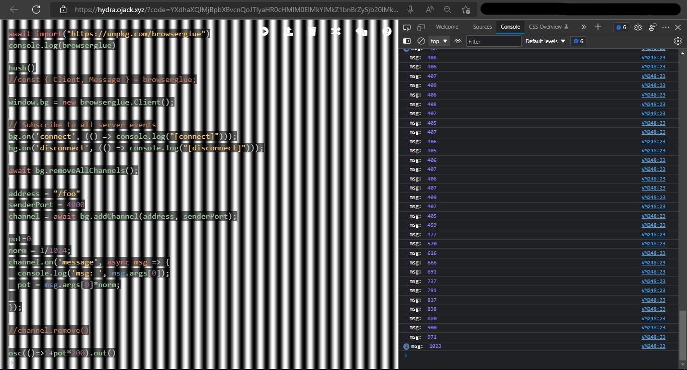

[johnny-five]: http://johnny-five.io
[hydra-web-app]:https://hydra.ojack.xyz/
[hydra-repo]:https://github.com/hydra-synth/hydra
# hydra-browserglue-johnny-five
|||
|-|-|
|hydra  ([web][hydra-web-app], [repositorio][hydra-repo]) pegado a arduino usando [browserglue] and [johnny-five]; hydra controlado por arduino/ arduino controlando a hydra |hydra ([web app][hydra-web-app], [repo][hydra-repo]) glued with arduino using [browserglue] and [johnny-five]; hydra controlled by arduino/arduino controlling hydra|
|||

## 1 browserglue: ejecutable / executable

### 1.1
|||
|-|-|
|Aquí se usa [browserglue] un _software_ que expone varias conecciones OSC al navegador usando _websockets_ |Here [browserglue] is used, a software which "exposes multiple OSC connections to the browser through WebSockets"|
|||


[browserglue]:https://github.com/munshkr/browserglue
[browserglue-executable]:https://github.com/munshkr/browserglue/releases


## 2 johnny-five

### 2.0 prerrequisitos / requirements
|||
|-|-|
|Tenés que tener instalados `node` ( y `npm`, que se instala cuando se instala `node`)|must have `node` installed (and `npm` which is installed with `node`)|
|||

### 2.1

|||
|-|-|
|descargá este repo o clonalo y, en la línea de comandos, en la carpeta en la que descargastae o clonaste el repo, ejecutá:|download this repo or clone it and, in a terminal window, in the folder you downloaded or cloned,  run: |
|||

`npm install`

### 2.3

[potentiometer example]: http://johnny-five.io/examples/potentiometer/

[potentiometer code]: https://github.com/rwaldron/johnny-five/blob/main/eg/potentiometer.js

|||
|-|-|
|En este repositorio se usa el ejemplo del sensor más sencillo: un potenciometro [el ejemplo][potentiometer example], [el código][potentiometer code] |In this repo we use the example of the simplest sensor [potentiometer example], [potentiometer code].|
|||

`node index.js`


|||
|-|-|
|y, en el archivo `index.js`, se le adiciona el envío de mensajes OSC|and, at the `index.js` file, OSC message sending is added|
|||

|||
|-|-|
| ejecute el programa con el siguiente commando | run this file with the command line tool|
|||

`node index.js`

## 3  hydra
### 3.0
|||
|-|-|
|Ejecutá estas lineas una por una, si ejecutás todo el sketch de una, no te va a funcionar (esto tal vez no es cierto pero mejor hacelo así , ja ja)|Run this lines one by one, it won't work if you run all the sketch at once(this might not be true, but better do so, ha ha)|
|||
### 3.1 
|||
|-|-|
|Cargá `browserglue` en `hydra` corriendo la siguiente línea de código en ,esto es,  oprimí `ctrl+enter` con el cursor sobre la linea misma|Load `browserglue` into `hydra` running the following line of code, that is, press `ctrl+enter` with cursor caret on the line|
|||

```js
await import("https://unpkg.com/browserglue")
```

### 3.2
|||
|-|-|
|Creá un cliente de `browserglue` |Create a browserglue client|
|||

```js
window.bg = new browserglue.Client();
```
### 3.3
|||
|-|-|
|Las siguientes lineas de código creán un canal de comunicación usando websockect que se comunica con el ejecutable de la sección 1.1 de este documento | The nex portion of code creates a browserglue channel that bridges with the executable refered at section 1.1 above|
|los valores de la variables `address` y  `senderPort` deben coincidir con los valores de las mismas variables en el código del archivo  `index.js` |the values of variables `address` and `senderPort` must be the same as the values of the variableswith the same name in the `index.js` file.|
|||

```js
address = "/foo"
senderPort = 4000
channel = await bg.addChannel(address, senderPort);
```

### 3.4
|||
|-|-|
|código encargado de escuchar los mensajes enviados por el canal y de usar el valor en un boceto de hydra  |code in charge of receiving the websocket messages and use the value received in hydra functions|
|||
```js
pot=0
norm = 1/1024;
channel.on('message', async msg => {
  console.log('msg: ', msg.args[0]);
  pot = msg.args[0]*norm;
  
});


//finally, for example
osc(()=>1+pot*200).out()
```
### 3.5 
|||
|-|-|
|captura de pantalla del código funcionando: hay más código en la captura que el  código explicado en este documento, es código que puede ser de ayuda al desarrollar un boceto  |screenshot of working code: there's more code on the screenshot than the explained in this doc, it is just code that might help while developing the a sketch|
|||



|||
|-|-|
|aunque puede que el boceto no se ejecute  adecaudamente al hacerle _click_ al siguiente  _link_ (porque hay que ejecutar ciertas líneas con un retraso entre sí) , ahí está [el código][the code]. Esto al parecer no es cierto, me ha funcionado | Although the sketch might not run properly when clicking on the following link (since there must be some delay between the execution of some lines) [the code] is there. This might not be true, sometimes it works|
|||


[the code]: https://hydra.ojack.xyz/?code=YXdhaXQlMjBpbXBvcnQoJTIyaHR0cHMlM0ElMkYlMkZ1bnBrZy5jb20lMkZicm93c2VyZ2x1ZSUyMiklMEFjb25zb2xlLmxvZyhicm93c2VyZ2x1ZSklMEElMEFodXNoKCklMEElMkYlMkZjb25zdCUyMCU3QiUyMENsaWVudCUyQyUyME1lc3NhZ2UlMjAlN0QlMjAlM0QlMjBicm93c2VyZ2x1ZSUzQiUwQSUwQXdpbmRvdy5iZyUyMCUzRCUyMG5ldyUyMGJyb3dzZXJnbHVlLkNsaWVudCgpJTNCJTBBJTBBJTJGJTJGJTIwU3Vic2NyaWJlJTIwdG8lMjBhbGwlMjBzZXJ2ZXIlMjBldmVudHMlMEFiZy5vbignY29ubmVjdCclMkMlMjAoKCklMjAlM0QlM0UlMjBjb25zb2xlLmxvZyglMjIlNUJjb25uZWN0JTVEJTIyKSkpJTNCJTBBYmcub24oJ2Rpc2Nvbm5lY3QnJTJDJTIwKCgpJTIwJTNEJTNFJTIwY29uc29sZS5sb2coJTIyJTVCZGlzY29ubmVjdCU1RCUyMikpKSUzQiUwQSUwQWF3YWl0JTIwYmcucmVtb3ZlQWxsQ2hhbm5lbHMoKSUzQiUwQSUwQWFkZHJlc3MlMjAlM0QlMjAlMjIlMkZmb28lMjIlMEFzZW5kZXJQb3J0JTIwJTNEJTIwNDAwMCUwQWNoYW5uZWwlMjAlM0QlMjBhd2FpdCUyMGJnLmFkZENoYW5uZWwoYWRkcmVzcyUyQyUyMHNlbmRlclBvcnQpJTNCJTBBJTBBcG90JTNEMCUwQW5vcm0lMjAlM0QlMjAxJTJGMTAyNCUzQiUwQWNoYW5uZWwub24oJ21lc3NhZ2UnJTJDJTIwYXN5bmMlMjBtc2clMjAlM0QlM0UlMjAlN0IlMEElMjAlMjBjb25zb2xlLmxvZygnbXNnJTNBJTIwJyUyQyUyMG1zZy5hcmdzJTVCMCU1RCklM0IlMEElMjAlMjBwb3QlMjAlM0QlMjBtc2cuYXJncyU1QjAlNUQqbm9ybSUzQiUwQSUyMCUyMCUwQSU3RCklM0IlMEElMEElMkYlMkZjaGFubmVsLnJlbW92ZSgpJTBBJTBBb3NjKCgpJTNEJTNFMSUyQnBvdCoyMDApLm91dCgpJTBBJTBB

<small>a gist would have been enough</small>